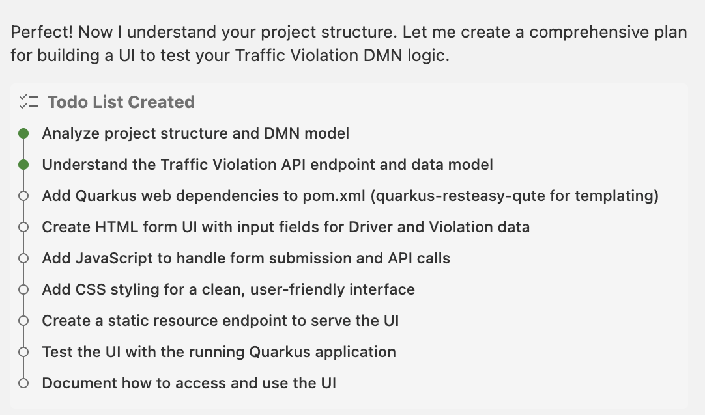

# 🤖 Bob - Your DMN Assistant Guide

## 📚 Table of Contents
1. [Project Overview](#project-overview)
2. [Understanding the DMN Models](#understanding-the-dmn-models)
3. [Traffic Violation Decision Logic](#traffic-violation-decision-logic)
4. [Current Business Rules](#current-business-rules)
5. [Lab Exercise 1: New Regulation Implementation](#lab-exercise-new-regulation-implementation)
6. [Lab Exercise 2: Working with Bob as Your DMN Assistant](#lab-exercise-2-working-with-bob-as-your-dmn-assistant)
7. [Lab Exercise 3: Building the User Interface](#lab-exercise-3-building-the-user-interface)
8. [User Experience Guide](#user-experience-guide)

---

## 🎯 Project Overview

### What is This Project?

This is a **DMN (Decision Model and Notation) Quarkus Example** that demonstrates business decision automation using:
- **IBM BAMOE** (Business Automation Manager Open Edition) v9.3.1
- **Kogito** - Cloud-native business automation
- **Quarkus** - Supersonic Subatomic Java framework
- **DMN 1.5** - OMG Decision Model and Notation standard

### Project Structure

```
dmn-quarkus-example/
├── src/main/resources/
│   ├── Traffic Violation.dmn          # Main DMN model for traffic violations
│   ├── AllowedValuesChecksInsideCollection.dmn  # Example with type constraints
├── src/test/java/                     # JUnit tests
│   └── org/kie/kogito/dmn/quarkus/example/
│       ├── TrafficViolationTest.java  # REST API tests
│       └── AllowedValuesTest.java     # Type validation tests
├── pom.xml                            # Maven configuration
└── README.md                          # Project documentation
```

### Key Technologies

- **DMN Engine**: Evaluates decision models
- **FEEL**: Friendly Enough Expression Language for decision logic
- **REST API**: Auto-generated from DMN models
- **Quarkus Dev Mode**: Hot reload for rapid development

---

## 🧠 Understanding the DMN Models

### 1. Traffic Violation DMN Model

**Purpose**: Evaluate traffic violations and determine fines and license suspension

**File**: `src/main/resources/Traffic Violation.dmn`

#### Data Types (Item Definitions)

**tDriver** - Driver information structure:
```
- Name: string
- Age: number
- State: string
- City: string
- Points: number (current points on license)
```

**tViolation** - Violation details:
```
- Code: string
- Date: date
- Type: string (allowed: "speed", "parking", "driving under the influence")
- Speed Limit: number
- Actual Speed: number
```

**tFine** - Fine calculation result:
```
- Amount: number (dollar amount)
- Points: number (penalty points)
```

#### Decision Flow

```
┌─────────────┐         ┌─────────────┐
│  Violation  │────────▶│    Fine     │
│   (Input)   │         │ (Decision)  │
└─────────────┘         └──────┬──────┘
                               │
┌─────────────┐                │
│   Driver    │                │
│   (Input)   │                │
└──────┬──────┘                │
       │                       │
       │                       ▼
       │                ┌──────────────────────┐
       └───────────────▶│ Should the driver be │
                        │    suspended?        │
                        │    (Decision)        │
                        └──────────────────────┘
```

**Information Requirements**:
1. **Fine Decision** requires: Violation input
2. **Suspension Decision** requires: Driver input, Fine decision


### Compile and Run in Local Dev Mode

```
mvn clean compile quarkus:dev
```


## OpenAPI (Swagger) documentation
[Specification at swagger.io](https://swagger.io/docs/specification/about/)

You can take a look at the [OpenAPI definition](http://localhost:8080/q/openapi?format=json) - automatically generated and included in this service - to determine all available operations exposed by this service. For easy readability you can visualize the OpenAPI definition file using a UI tool like for example available [Swagger UI](https://editor.swagger.io).

In addition, various clients to interact with this service can be easily generated using this OpenAPI definition.

When running in either Quarkus Development or Native mode, we also leverage the [Quarkus OpenAPI extension](https://quarkus.io/guides/openapi-swaggerui#use-swagger-ui-for-development) that exposes [Swagger UI](http://localhost:8080/q/swagger-ui/) that you can use to look at available REST endpoints and send test requests.

## Test DMN Model using Maven

Validate the functionality of DMN models before deploying them into a production environment by defining test scenarios in Test Scenario Editor. 

To define test scenarios you need to create a .scesim file inside your project and link it to the DMN model you want to be tested. Run all Test Scenarios, executing:

```sh
mvn clean test
```
See results in surefire test report `target/surefire-reports` 

## Example Usage

Once the service is up and running, you can use the following example to interact with the service.

### POST /Traffic Violation

Returns penalty information from the given inputs -- driver and violation:

Given inputs:

```json
{
    "Driver":{"Points":2},
    "Violation":{
        "Type":"speed",
        "Actual Speed":120,
        "Speed Limit":100
    }
}
```

Curl command (using the JSON object above):

```sh
curl -X POST -H 'Accept: application/json' -H 'Content-Type: application/json' -d '{"Driver":{"Points":2},"Violation":{"Type":"speed","Actual Speed":120,"Speed Limit":100}}' http://localhost:8080/Traffic%20Violation
```
or on Windows:

```sh
curl -X POST -H "Accept: application/json" -H "Content-Type: application/json" -d "{\"Driver\":{\"Points\":2},\"Violation\":{\"Type\":\"speed\",\"Actual Speed\":120,\"Speed Limit\":100}}" http://localhost:8080/Traffic%20Violation
```

As response, penalty information is returned.

Example response:

```json
{
  "Violation":{
    "Type":"speed",
    "Speed Limit":100,
    "Actual Speed":120
  },
  "Driver":{
    "Points":2
  },
  "Fine":{
    "Points":3,
    "Amount":500
  },
  "Should the driver be suspended?":"No"
}
```

---

## 📊 Traffic Violation Decision Logic

### Decision 1: Fine Calculation

**Ask Bob**: "Please review the project and provide me the purpose of this decision project"

### Example of responses : 

**Type**: Decision Table (UNIQUE hit policy)
**Inputs**: 
- Violation.Type
- Violation.Actual Speed - Violation.Speed Limit (speed difference)

**Outputs**:
- Amount (fine in dollars)
- Points (penalty points)

**Rules**:

| # | Violation Type | Speed Difference | Fine Amount | Points |
|---|----------------|------------------|-------------|--------|
| 1 | "speed" | [10..30) km/h | $500 | 3 |
| 2 | "speed" | >= 30 km/h | $1000 | 7 |
| 3 | "parking" | - (any) | $100 | 1 |
| 4 | "driving under the influence" | - (any) | $1000 | 5 |

**FEEL Expressions Used**:
- `[10..30)` - Range: 10 inclusive to 30 exclusive
- `>= 30` - Greater than or equal to 30
- `-` - Any value (don't care)

### Decision 2: Should the Driver Be Suspended?

**Type**: Context (boxed expression)
**Logic**: Two-step calculation

**Step 1: Calculate Total Points**
```feel
Total Points = Driver.Points + Fine.Points
```

**Step 2: Determine Suspension**
```feel
if Total Points >= 20
then "Yes"
else "No"
```

**Suspension Criteria**:
1. Total points >= 20

---

## 📋 Current Business Rules

### Rule Summary

1. **Speed Violations**:
   - Minor (10-29 km/h over): $500 fine, 3 points
   - Major (30+ km/h over): $1000 fine, 7 points

2. **Parking Violations**:
   - Fixed: $100 fine, 1 point

3. **DUI Violations**:
   - Fixed: $1000 fine, 5 points

4. **License Suspension**:
   - Triggered at 20+ total points

### Example Scenarios

**Scenario A: Minor Speed Violation**
```
Input:
  Driver.Points = 2
  Violation.Type = "speed"
  Violation.Speed Limit = 100
  Violation.Actual Speed = 120

Calculation:
  Speed difference = 120 - 100 = 20 km/h
  Rule matched: [10..30) → $500, 3 points
  Total Points = 2 + 3 = 5
  Suspension check: 5 < 20 → "No"

Result:
  Fine.Amount = 500
  Fine.Points = 3
  Should the driver be suspended? = "No"
```

**Scenario B: High Points Risk**
```
Input:
  Driver.Points = 15
  Violation.Type = "speed"
  Violation.Speed Limit = 100
  Violation.Actual Speed = 135

Calculation:
  Speed difference = 135 - 100 = 35 km/h
  Rule matched: >= 30 → $1000, 7 points
  Total Points = 15 + 7 = 22
  Suspension check: 22 >= 20 → "Yes"

Result:
  Fine.Amount = 1000
  Fine.Points = 7
  Should the driver be suspended? = "Yes"
```

---

## 🎓 Lab Exercise: New Regulation Implementation

### The Challenge

**New Regulation**: Due to increasing extreme speeding incidents, authorities require **automatic license suspension when a driver's actual speed is double (or more) the speed limit**.

### Current State

❌ The Suspension decision only checks total points (>= 20)
❌ Extreme speeding (2× speed limit) is not considered for suspension
❌ The Suspension decision does NOT have access to Violation data

#### Current Decision Flow

```
┌─────────────┐         ┌─────────────┐
│  Violation  │────────▶│    Fine     │
│   (Input)   │         │ (Decision)  │
└─────────────┘         └──────┬──────┘
                               │
┌─────────────┐                │
│   Driver    │                │
│   (Input)   │                │
└──────┬──────┘                │
       │                       │
       │                       ▼
       │                ┌──────────────────────┐
       └───────────────▶│ Should the driver be │
                        │    suspended?        │
                        │    (Decision)        │
                        └──────────────────────┘
```

**Current Information Requirements**:
- Fine Decision requires: Violation input
- Suspension Decision requires: Driver input, Fine decision

**Switch to DMN FEEL Editior**

Switch to DMN FEEL EDITOR : 




**Ask Bob**: "Due to increasing extreme speeding incidents, authorities require automatic license suspension when a driver's actual speed is double (or more) the speed limit"

Bob will propose several to do several step to udpate the decision rules : 

### Example of response:

#### Step 1: Add Information Requirement

The Suspension decision needs access to Violation information to check actual speed vs. speed limit.

**In DMN Editor**:
1. Open `Traffic Violation.dmn`
2. Add an information requirement arrow from "Violation" input to "Should the driver be suspended?" decision
3. This allows the Suspension decision to access `Violation.Actual Speed` and `Violation.Speed Limit`

#### Step 2: Modify Suspension Logic

Update the Suspension decision's FEEL expression to include extreme speeding check.

**Current Logic**:
```feel
if Total Points >= 20
then "Yes"
else "No"
```

**Updated Logic**:
```feel
if Total Points >= 20 or Violation.Actual Speed >= 2 * Violation.Speed Limit
then "Yes"
else "No"
```

#### Step 3: Updated Decision Flow

After implementing the changes, the decision flow will look like this:

```
┌─────────────┐         ┌─────────────┐
│  Violation  │────────▶│    Fine     │
│   (Input)   │         │ (Decision)  │
└──────┬──────┘         └──────┬──────┘
       │                       │
       │  ┌─────────────┐      │
       │  │   Driver    │      │
       │  │   (Input)   │      │
       │  └──────┬──────┘      │
       │         │             │
       │         │             ▼
       │         │      ┌──────────────────────┐
       │         └─────▶│ Should the driver be │
       └───────────────▶│    suspended?        │
                        │    (Decision)        │
                        └──────────────────────┘
```

**Updated Information Requirements**:
- Fine Decision requires: Violation input
- Suspension Decision requires: Driver input, Fine decision, **Violation input (NEW)**

#### Step 4: Understanding the New Logic

**Suspension Criteria** (either condition triggers suspension):
1. **Total Points >= 20** (existing rule)
2. **Actual Speed >= 2 × Speed Limit** (NEW - extreme speeding)

**Examples**:
- Speed Limit: 100 km/h, Actual Speed: 200 km/h → **Suspend** (2× limit)
- Speed Limit: 50 km/h, Actual Speed: 105 km/h → **Suspend** (>2× limit)
- Speed Limit: 100 km/h, Actual Speed: 180 km/h → Check points only

### Compile and Run in Local Dev Mode

```
mvn clean compile quarkus:dev
```

### Testing the New Regulation

**Test Case 1: Extreme Speeding - Low Points**
```json
{
  "Driver": {
    "Name": "Speed Demon",
    "Age": 25,
    "Points": 2
  },
  "Violation": {
    "Type": "speed",
    "Speed Limit": 100,
    "Actual Speed": 200
  }
}

Expected Result:
  Fine.Amount = 1000
  Fine.Points = 7
  Total Points = 2 + 7 = 9
  Should the driver be suspended? = "Yes" (200 >= 2 × 100)
```

**Test Case 2: High Speed but Not Extreme**
```json
{
  "Driver": {
    "Name": "Fast Driver",
    "Age": 30,
    "Points": 5
  },
  "Violation": {
    "Type": "speed",
    "Speed Limit": 100,
    "Actual Speed": 180
  }
}

Expected Result:
  Fine.Amount = 1000
  Fine.Points = 7
  Total Points = 5 + 7 = 12
  Should the driver be suspended? = "No" (180 < 200 AND 12 < 20)
```

**Test Case 3: Extreme Speeding in School Zone**
```json
{
  "Driver": {
    "Name": "Reckless Driver",
    "Age": 28,
    "Points": 0
  },
  "Violation": {
    "Type": "speed",
    "Speed Limit": 50,
    "Actual Speed": 110
  }
}

Expected Result:
  Fine.Amount = 1000
  Fine.Points = 7
  Total Points = 0 + 7 = 7
  Should the driver be suspended? = "Yes" (110 >= 2 × 50)
```

---

## 🎓 Lab Exercise 2: Building the User Interface

### The Challenge

**Objective**: Create a web-based user interface to test the Traffic Violation DMN model through REST API calls.

### Prerequisites

Before building the UI, you need to compile the project to generate the REST API endpoints:

```bash
mvn clean compile quarkus:dev
```

This command will:
1. ✅ Compile the DMN models
2. ✅ Generate REST API endpoints automatically
3. ✅ Start Quarkus in development mode with hot reload
4. ✅ Make the API available at `http://localhost:8080`

### Understanding the Generated REST API

Once compiled, Quarkus automatically generates a REST endpoint for your DMN model:

**Endpoint**: `POST /Traffic Violation`

**Request Format**:
```json
{
  "Driver": {
    "Name": "John Doe",
    "Age": 35,
    "State": "California",
    "City": "Los Angeles",
    "Points": 2
  },
  "Violation": {
    "Type": "speed",
    "Code": "SPD-001",
    "Date": "2024-01-15",
    "Speed Limit": 100,
    "Actual Speed": 120
  }
}
```

**Response Format**:
```json
{
  "Fine": {
    "Amount": 500,
    "Points": 3
  },
  "Should the driver be suspended?": "No"
}
```


### Step 1: Testing the UI

1. **Start the application**:
   ```bash
   mvn clean compile quarkus:dev
   ```

2. **Open browser**:
   ```
   http://localhost:8080
   ```

3. **Test scenarios**:
   - Minor speed violation
   - Major speed violation
   - Parking violation
   - DUI violation
   - Extreme speeding (for Lab 1 implementation)

### Step 2: Enhancements

#### Enhancement 1: Example Data Loader

Add a console function to quickly load test data:

#### Enhancement 3: Points Warning

Show warning when approaching suspension

### Testing Your Implementation

**Test Case 1: Basic Speed Violation**
- Driver Points: 2
- Violation Type: speed
- Speed Limit: 100
- Actual Speed: 120

Expected: $500 fine, 3 points, no suspension

**Test Case 2: Extreme Speeding**
- Driver Points: 2
- Violation Type: speed
- Speed Limit: 100
- Actual Speed: 200

Expected: $1000 fine, 7 points, **SUSPENDED** (if Lab 1 implemented)

**Test Case 3: Parking Violation**
- Driver Points: 5
- Violation Type: parking

Expected: $100 fine, 1 point, no suspension

### Troubleshooting

**Issue**: API returns 404
- **Solution**: Make sure you compiled the project with `mvn clean compile quarkus:dev`

**Issue**: Results not displaying
- **Solution**: Check browser console for errors; verify API response format

### Success Criteria

✅ Form accepts all required inputs
✅ Speed fields show/hide based on violation type
✅ API call successfully reaches DMN endpoint
✅ Results display correctly with proper formatting
✅ Suspension status is color-coded
✅ UI is responsive on mobile devices
✅ Error handling works for invalid inputs

### Next Steps

After completing Lab 3:
1. Test all violation types through the UI
2. Verify Lab 1 implementation works correctly
3. Apply Lab 2 learnings to enhance the UI
4. Add additional features (speed ratio display, warnings, etc.)

---

## 🎯 Next Steps

### Complete the Lab Exercises

Now that you understand the Traffic Violation DMN model, complete the three lab exercises:

#### Lab 1: Extreme Speeding Suspension Rule
1. ⬜ Open DMN model in editor
2. ⬜ Add information requirement from Violation to Suspension decision
3. ⬜ Update Suspension decision logic with extreme speeding check
4. ⬜ Test with extreme speeding scenarios
5. ⬜ Verify suspension triggers at 2× speed limit

**Ask Bob**: "Help me implement the extreme speeding suspension rule"

**Ask Bob**: "Let's work through Lab 2 exercises together"

#### Lab 2: Build the User Interface
1. ⬜ Compile project: `mvn clean compile quarkus:dev`
2. ⬜ Create HTML form with driver and violation inputs
3. ⬜ Implement JavaScript to call REST API
4. ⬜ Display results with proper formatting
5. ⬜ Test all violation types through the UI

**Ask Bob**: "Guide me through building the web interface"

### Beyond the Labs

After completing all three labs, continue your DMN journey:

**Summary of What You've Learned**:
1. ✅ Lab 1: Implemented extreme speeding suspension rule (DMN modeling)
2. ✅ Lab 2: Learned to work effectively with Bob (AI collaboration)
3. ✅ Lab 3: Built the user interface (Full-stack development)

**Next Steps**:

1. **Implement Additional Rules**:
   - Senior driver discounts
   - School zone violations
   - First-time offender leniency
   - City-specific parking fines

2. **Enhance the UI**:
   - Add speed ratio warnings
   - Show decision path explanations
   - Create scenario presets
   - Add points warning indicators

3. **Create Comprehensive Tests**:
   - JUnit test suites
   - Edge case coverage
   - Integration tests
   - Performance tests

4. **Deploy Your Application**:
   - Build native executable
   - Deploy to Kubernetes
   - Set up CI/CD pipeline
   - Monitor in production

5. **Share Your Knowledge**:
   - Document your DMN models
   - Create user guides
   - Present to stakeholders
   - Mentor other developers

### Remember

✅ Bob is always here to help with any DMN challenge
✅ Be specific in your requests
✅ Iterate and test frequently
✅ Ask for explanations to deepen your understanding
✅ Request test cases for all new features

**Ready to start?** Just ask Bob: "Let's begin with Lab 1!"

---

**Bob is ready to assist you with DMN development! 🚀**

*This guide was created by Bob, your DMN Assistant*